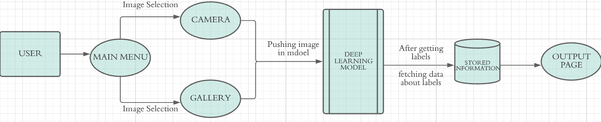
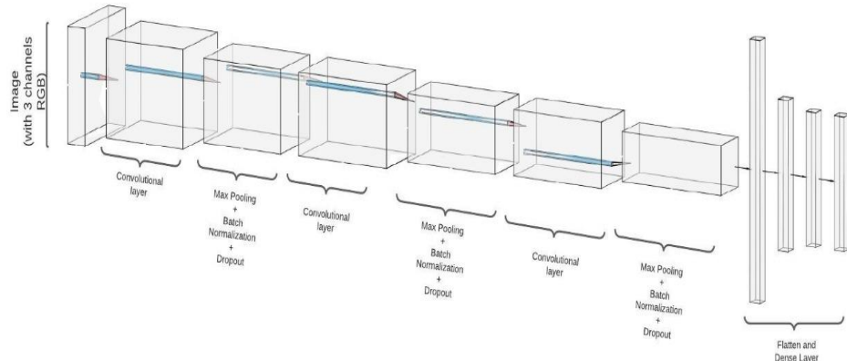
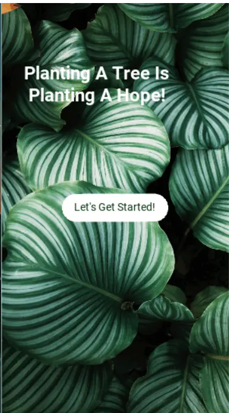

## Table of contents
* <a href="#Objective">Objective</a>
* <a href="#Problem Statement">Problem Statement</a>
* <a href="#Abstract">Abstract</a>
* <a href="#Flowchart">Flowchart</a>
* <a href="#Proposed%20Design">Proposed Design</a>
* <a href="#Model_Architecture">Model_Architecture</a>
* <a href="#Conclusion">Conclusion</a>
* <a href="#Screenshots">Screenshots</a>

<h2 id="Objective">Objective</h2>
To create the plant disease detection platform that will use deep learning technologies to provide new level of service to farmer’s community.

<h2 id="Problem Statement">Problem Statement</h2>
Crop losses are a major threat to the wellbeing of rural families, to the economy and governments, and to food security worldwide. As agriculture struggles to support the rapidly growing global population, plant disease reduces the production and quality of food, fibre and biofuel crops. Losses may be catastrophic or chronic, but on average account for 32% of the production of the six most important food crops. About 16% of all crops are lost to plant diseases each year.

<h2 id="Abstract">Abstract</h2>
Plant diseases and pests cause the loss of 15 to 30 % of the annual harvests. Suffering farmers are the results. We believe that smart farming is the solution. Working with artificial intelligence and image recognition our application can help farmers worldwide to protect their plants. Together we can ensure a safe food production for us and the generations to come! Our App Guarden for smart phones detects damage on plants with the help of smart phone image. By taking a simple picture with your smartphone, Guarden can help you to protect your plants from diseases, pests and the lack of nutrition.  It gives you a lot of expert information - ranging from the diagnosis of plant damages to different treatments and preventive measures. Every plant disease, pest, or nutrient deficiency leaves a specific pattern to which our application quickly learns to detect with up to 90% accuracy. With our software, we can provide customized solutions for every need.

## Flowchart

<h2 id="Proposed Design">Proposed Design</h2>
Mobile internet connectivity enables uploading of image to a cloud based server where our classification model consist of deep neural nets are used to process the optical patterns and detect the diseases .This information is conveyed back to the user within few seconds along with suggested knowledge on disease management including biological and chemical control methods.

## Model_Architecture

  
<h2 id="Limitations">Limitations</h2>
•	Due to limited image dataset our AI model cannot classify  all the diseases.
•	Output may be incorrect if the image is blur or if image not focuses on the part of leaf which is affected by disease. 

## Conclusion
A lot of smallholders sometimes cannot recognize the disease their crops are suffering from, so our application is a helper to the farmers who are unaware of the disease and its cure. Our application has a user-friendly interface which makes it easy to use even for a farmer.  

## Screenshots

